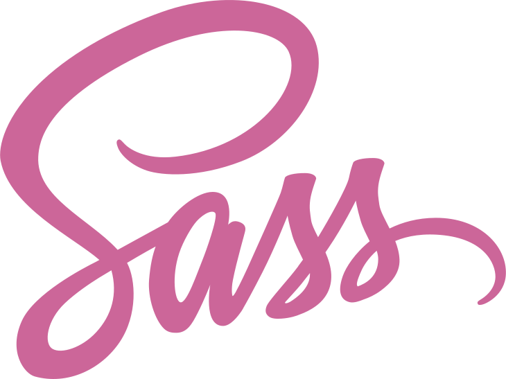

# Asano Mitsui

Hi, I am a software developer and I am 24.

## Major Activities

- 🖥️ Programming
    - 🦀 Rust
    - 🌐 Web dev.
    - 🪄 Graphics
    - Android/iOS
    -AWS
    -Kotlin/Swift
- 🎶 Music
    - 🎻 Classical Music
    - 🎹 Playing piano
    - 🎼 Composition
- 🎨 Illustration
- 白雪の剣

## Languages & Tools

    &emsp;<a href="https://rust-lang.org"><!--
        The Rust logo (`rust-logo-512x512.png`) is owned by Mozilla and distributed under the terms of the [Creative Commons Attribution license (CC-BY)](https://creativecommons.org/licenses/by/4.0/).
    --></a>&emsp;<a href="https://svelte.dev"><!--
        A logo of the svelte framework by Rich Harris:
        [these people](https://github.com/sveltejs/svelte/graphs/contributors), MIT <http://opensource.org/licenses/mit-license.php>, via Wikimedia Commons
    --></a>&emsp;<a href="https://git-scm.com"><!--
        Git Logo by [Jason Long](https://bsky.app/profile/jasonlong.me) is licensed under the [Creative Commons Attribution 3.0 Unported License](https://creativecommons.org/licenses/by/3.0/).
    --></a>&emsp;<a href="https://opengl.org"><!--
        OpenGL Shading Language logo (Unofficial):
        Jim McKeeth, CC BY-SA 4.0 <https://creativecommons.org/licenses/by-sa/4.0>, via Wikimedia Commons
    --></a>&emsp;<a href="https://docs.microsoft.com/en-us/windows/win32/direct3dhlsl/dx-graphics-hlsl"><!--
        HL:
        © 2022 Asano
    --></a>&emsp;<a href="https://www.w3.org/TR/html5"><!--
        HTML5 logo without wordmark.:
        W3C, CC BY 3.0 <https://creativecommons.org/licenses/by/3.0>, via Wikimedia Commons
    --></a>&emsp;<a href="https://www.w3.org/TR/CSS"><!--
        The logo endorsed by the W3C CSS Working Group.:
        Javi Aguilar and The CSS-Next Community Group, CC0, via Wikimedia Commons
    --></a>&emsp;<a href="https://sass-lang.com"><!--
        Sass Logo Color:
        This work is licensed under a [Creative Commons Attribution-NonCommercial-ShareAlike 3.0 Unported License](https://creativecommons.org/licenses/by-nc-sa/3.0/deed.en_US).
    --></a>&emsp;<a href="https://typescriptlang.org"><!--
        https://typescriptlang.org/branding
    --></a>&emsp;<a href="https://ecma-international.org/publications-and-standards/standards/ecma-262"><!--
        The logo for the progamming language JavaScript:
        Christopher Williams, via Wikimedia Commons
    --></a>

## Environments

    &emsp;<a href="https://fedoraproject.org/workstation"><!--
        Fedora icon:
        ™/®Red Hat, Inc., via Wikimedia Commons
    --></a>&emsp;<a href="https://microsoft.com/en-us/windows/windows-11"><!--
        The current logo used for Microsoft Windows 11, introduced in June 2021:
        OAOV, via Wikimedia Commons
    --></a>&emsp;<a href="https://apple.com/ios/ios"><!--
        Wordmark of iOS:
        Original:  Apple Inc.Vectorization:  Totie, via Wikimedia Commons
    --></a>&emsp;<a href="https://android.com/intl/en/android-10"><!--
        Vector tracing of Android 10 logo:
        Google, via Wikimedia Commons
    --></a>

## Contacts

    &emsp;
    &emsp;
    

- Email: [asanoosakauniversity607@gmail.com](mailto:asanoosakauniversity607@gmail.com)

[and more](https://rinrin.pages.dev/social)

## Website

<a href="https://asanodream.carrd.co/">Asano fast review</a>
